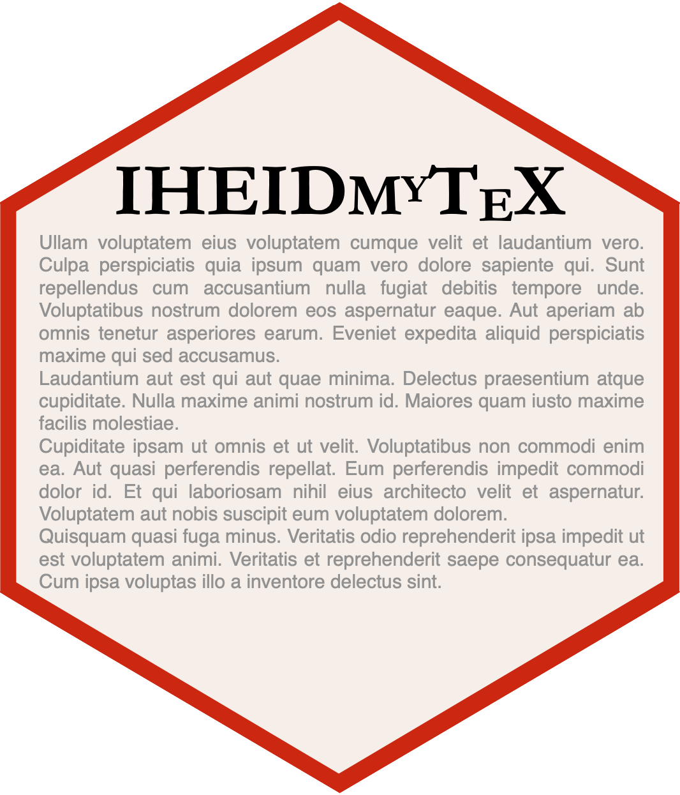

# iheidmytex  

## About

This repo contains a LaTeX class for dissertations and papers at the 
Graduate Institute of International and Development Studies/
Institut de Hautes Études Internationales et du Développement.

You can find the most recent version of the dissertation example 
[here](https://github.com/jhollway/iheidmytex/releases) 
under the assets associated with each version.

PS: If you find LaTeX intimidating to learn,
take a look at the [`iheiddown`](https://github.com/jhollway/iheiddown) package instead.
By using the package with RStudio, 
you can write your dissertation in [markdown](https://www.markdownguide.org/getting-started/),
which is much simpler to write (and read).
Check it out!

## Getting started

First, you will need [a LaTeX distribution](https://www.latex-project.org/get/) installed on your system.

To use this class, simply download the class files (`iheid.cls` and `projectinfo.cls`)
and add them to the folder where your `.tex` file resides on your system.
You can also download and use `iheiddiss.tex` or `paper.tex` as templates to get started.
`mybib.bib` is just a placeholder bibliography and should be replaced with your own bibliographic library.

## Feedback

Please [raise an issue](https://github.com/jhollway/iheidmytex/issues) for this repo
if you encounter any bugs or if you have any suggestions, or get in touch with [me](https://jameshollway.com) if you want to contribute.

